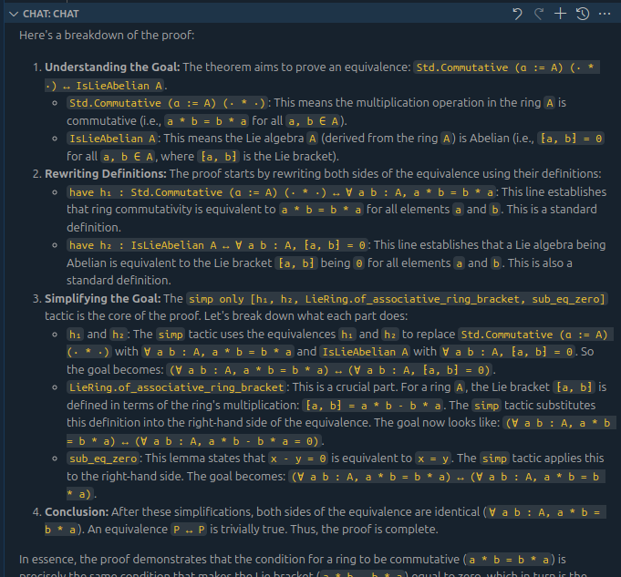
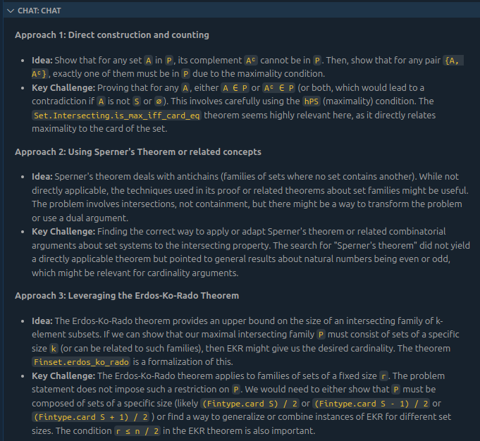

<h1 align="center">
  lean-lsp-mcp
</h1>

<h3 align="center">Lean Theorem Prover MCP</h3>

<p align="center">
  <a href="https://pypi.org/project/lean-lsp-mcp/">
    
  </a>
  <a href="">
    
  </a>
  <a href="https://github.com/oOo0oOo/lean-lsp-mcp/blob/master/LICENSE">
    
  </a>
</p>

MCP server that allows agentic interaction with the [Lean theorem prover](https://lean-lang.org/) via the [Language Server Protocol](https://microsoft.github.io/language-server-protocol/specifications/lsp/3.17/specification/) using [leanclient](https://github.com/oOo0oOo/leanclient). This server provides a range of tools for LLM agents to understand, analyze and interact with Lean projects.

**Currently beta testing**: Please help us by submitting bug reports and feature requests!

## Key Features

* **Rich Lean Interaction**: Access diagnostics, goal states, term information, hover documentation and more.
* **External Search Tools**: Use `leansearch`, `loogle`, `lean_hammer` and `lean_state_search` to find relevant theorems and definitions.
* **Easy Setup**: Simple configuration for various clients, including VSCode, Cursor and Claude Code.

## Setup

### Overview

1. Install [uv](https://docs.astral.sh/uv/getting-started/installation/), a Python package manager.
2. Make sure your Lean project builds quickly by running `lake build` manually.
3. Configure your IDE/Setup

### 1. Install uv

[Install uv](https://docs.astral.sh/uv/getting-started/installation/) for your system.

E.g. on Linux/MacOS:

```bash
curl -LsSf https://astral.sh/uv/install.sh | sh
```

### 2. Run `lake build`

`lean-lsp-mcp` will run `lake build` in the project root to use the language server (for most tools). Some clients (e.g. Cursor) might timeout during this process. Therefore, it is recommended to run `lake build` manually before starting the MCP. This ensures a faster build time and avoids timeouts.

E.g. on Linux/MacOS:
```bash
cd /path/to/lean/project
lake build
```

Note: Your build does not necessarily need to be successful, some errors or warnings (e.g. `declaration uses 'sorry'`) are OK.

### 3. a) VSCode Setup

VSCode and VSCode Insiders are supporting MCPs in [agent mode](https://code.visualstudio.com/blogs/2025/04/07/agentMode). For VSCode you might have to enable `Chat > Agent: Enable` in the settings.

1. One-click config setup:

[](https://insiders.vscode.dev/redirect/mcp/install?name=lean-lsp&config=%7B%22command%22%3A%22uvx%22%2C%22args%22%3A%5B%22lean-lsp-mcp%22%5D%7D)

[](https://insiders.vscode.dev/redirect/mcp/install?name=lean-lsp&config=%7B%22command%22%3A%22uvx%22%2C%22args%22%3A%5B%22lean-lsp-mcp%22%5D%7D&quality=insiders)

OR using the setup wizard:

Ctrl+Shift+P > "MCP: Add Server..." > "Command (stdio)" > "uvx lean-lsp-mcp" > "lean-lsp" (or any name you like) > Global or Workspace

OR manually add config to `mcp.json`:

```jsonc
{
    "servers": {
        "lean-lsp": {
            "type": "stdio",
            "command": "uvx",
            "args": [
                "lean-lsp-mcp"
            ]
        }
    }
}
```

2. Click "Start" above server config, open a Lean file, change to agent mode in the chat and run e.g. "auto proof" to get started.

### 3. b) Cursor Setup

1. Open MCP Settings (File > Preferences > Cursor Settings > MCP)

2. "+ Add a new global MCP Server" > ("Create File")

3. Paste the server config into `mcp.json` file:

```jsonc
{
    "mcpServers": {
        "lean-lsp": {
            "command": "uvx",
            "args": ["lean-lsp-mcp"]
        }
    }
}
```

### 3. c) Claude Code

Run one of these commands in the root directory of your Lean project (where `lakefile.toml` is located):

```bash
# Local-scoped MCP server
claude mcp add lean-lsp uvx lean-lsp-mcp

# OR project-scoped MCP server (creates or updates a .mcp.json file in the current directory)
claude mcp add lean-lsp -s project uvx lean-lsp-mcp

# OR If you run into issues with the project path (e.g. the language server directory cannot be found), you can also set it manually e.g.
claude mcp add lean-lsp uvx lean-lsp-mcp -e LEAN_PROJECT_PATH=$PWD
```

You can find more details about MCP server configuration for Claude Code [here](https://docs.anthropic.com/en/docs/agents-and-tools/claude-code/tutorials#configure-mcp-servers).

### Other Setups

Other setups, such as [Claude Desktop](https://modelcontextprotocol.io/quickstart/user), [OpenAI Agent SDK](https://openai.github.io/openai-agents-python/mcp/), [Windsurf](https://docs.windsurf.com/windsurf/cascade/mcp) or [Goose](https://block.github.io/goose/docs/getting-started/using-extensions) should work with similar configs.

### Transport Methods

The Lean LSP MCP server supports the following transport methods:

- `stdio`: Standard input/output (default)
- `streamable-http`: HTTP streaming
- `sse`: Server-sent events (MCP legacy, use `streamable-http` if possible)

You can specify the transport method using the `--transport` argument when running the server. For `sse` and `streamable-http` you can also optionally specify the host and port:

```bash
uvx lean-lsp-mcp --transport stdio # Default transport
uvx lean-lsp-mcp --transport streamable-http # Available at http://127.0.0.1:8000/mcp
uvx lean-lsp-mcp --transport sse --host localhost --port 12345 # Available at http://localhost:12345/sse
```

### Bearer Token Authentication

Transport via `streamable-http` and `sse` supports bearer token authentication. This allows publicly accessible MCP servers to restrict access to authorized clients.

Set the `LEAN_LSP_MCP_TOKEN` environment variable (or see section 3 for setting env variables in MCP config) to a secret token before starting the server.

Example Linux/MacOS setup:

```bash
export LEAN_LSP_MCP_TOKEN="your_secret_token"
uvx lean-lsp-mcp --transport streamable-http
```

Clients should then include the token in the `Authorization` header.

### Environment Variables

Some (optional) features and integrations of `lean-lsp-mcp` are configured using environment variables. These must be set in your shell or process environment before running the server.

- `LEAN_PROJECT_PATH`: (optional) Path to your Lean project root. Set this if the server cannot automatically detect your project.
- `LEAN_LSP_MCP_TOKEN`: (optional) Secret token for bearer authentication when using `streamable-http` or `sse` transport.
- `LEAN_STATE_SEARCH_URL`: (optional) URL for a self-hosted [premise-search.com](https://premise-search.com) instance.
- `LEAN_HAMMER_URL`: (optional) URL for a self-hosted [Lean Hammer Premise Search](https://github.com/hanwenzhu/lean-premise-server) instance.

You can also often set these environment variables in your MCP client configuration:

```jsonc
{
    "servers": {
        "lean-lsp": {
            "type": "stdio",
            "command": "uvx",
            "args": [
                "lean-lsp-mcp"
            ],
            "env": {
                "LEAN_PROJECT_PATH": "/path/to/your/lean/project",
            }
        }
    }
}
```

## Tools

Tools are currently the only way to interact with the MCP server.

### File interactions (LSP)

#### lean_file_contents

Get the contents of a Lean file, optionally with line number annotations.

#### lean_diagnostic_messages

Get all diagnostic messages for a Lean file. This includes infos, warnings and errors.

<details>
<summary>Example output</summary>

l20c42-l20c46, severity: 1<br>
simp made no progress

l21c11-l21c45, severity: 1<br>
function expected at
  h_empty
term has type
  T ∩ compl T = ∅

...
</details>

#### lean_goal

Get the proof goal at a specific location (line or line & column) in a Lean file.

<details>
<summary>Example output (line)</summary>
Before:<br>
S : Type u_1<br>
inst✝¹ : Fintype S<br>
inst✝ : Nonempty S<br>
P : Finset (Set S)<br>
hPP : ∀ T ∈ P, ∀ U ∈ P, T ∩ U ≠ ∅<br>
hPS : ¬∃ T ∉ P, ∀ U ∈ P, T ∩ U ≠ ∅<br>
compl : Set S → Set S := fun T ↦ univ \ T<br>
hcompl : ∀ T ∈ P, compl T ∉ P<br>
all_subsets : Finset (Set S) := Finset.univ<br>
h_comp_in_P : ∀ T ∉ P, compl T ∈ P<br>
h_partition : ∀ (T : Set S), T ∈ P ∨ compl T ∈ P<br>
⊢ P.card = 2 ^ (Fintype.card S - 1)<br>
After:<br>
no goals
</details>

#### lean_term_goal

Get the term goal at a specific position (line & column) in a Lean file.

#### lean_hover_info

Retrieve hover information (documentation) for symbols, terms, and expressions in a Lean file (at a specific line & column).

<details>
<summary>Example output (hover info on a `sorry`)</summary>
The `sorry` tactic is a temporary placeholder for an incomplete tactic proof,<br>
closing the main goal using `exact sorry`.<br><br>

This is intended for stubbing-out incomplete parts of a proof while still having a syntactically correct proof skeleton.<br>
Lean will give a warning whenever a proof uses `sorry`, so you aren't likely to miss it,<br>
but you can double check if a theorem depends on `sorry` by looking for `sorryAx` in the output<br>
of the `#print axioms my_thm` command, the axiom used by the implementation of `sorry`.<br>
</details>

#### lean_declaration_file

Get the file contents where a symbol or term is declared.

#### lean_completions

Code auto-completion: Find available identifiers or import suggestions at a specific position (line & column) in a Lean file.

#### lean_run_code

Run/compile an independent Lean code snippet/file and return the result or error message.
<details>
<summary>Example output (code snippet: `#eval 5 * 7 + 3`)</summary>
l1c1-l1c6, severity: 3<br>
38
</details>

#### lean_multi_attempt

Attempt multiple lean code snippets on a line and return goal state and diagnostics for each snippet.
This tool is useful to screen different proof attempts before using the most promising one.

<details>
<summary>Example output (attempting `rw [Nat.pow_sub (Fintype.card_pos_of_nonempty S)]` and `by_contra h_neq`)</summary>
  rw [Nat.pow_sub (Fintype.card_pos_of_nonempty S)]:<br>
S : Type u_1<br>
inst✝¹ : Fintype S<br>
inst✝ : Nonempty S<br>
P : Finset (Set S)<br>
hPP : ∀ T ∈ P, ∀ U ∈ P, T ∩ U ≠ ∅<br>
hPS : ¬∃ T ∉ P, ∀ U ∈ P, T ∩ U ≠ ∅<br>
⊢ P.card = 2 ^ (Fintype.card S - 1)<br>
<br>
l14c7-l14c51, severity: 1<br>
unknown constant 'Nat.pow_sub'<br>
<br>
  by_contra h_neq:<br>
 S : Type u_1<br>
inst✝¹ : Fintype S<br>
inst✝ : Nonempty S<br>
P : Finset (Set S)<br>
hPP : ∀ T ∈ P, ∀ U ∈ P, T ∩ U ≠ ∅<br>
hPS : ¬∃ T ∉ P, ∀ U ∈ P, T ∩ U ≠ ∅<br>
h_neq : ¬P.card = 2 ^ (Fintype.card S - 1)<br>
⊢ False<br>
<br>
...
</details>

### External Search Tools

Currently all external tools are **rate limited to 3 requests per 30 seconds**. This will change based on provider feedback.

#### lean_leansearch

Search for theorems in Mathlib using [leansearch.net](https://leansearch.net) (natural language search).

[Github Repository](https://github.com/frenzymath/LeanSearch) | [Arxiv Paper](https://arxiv.org/abs/2403.13310)

- Supports natural language, mixed queries, concepts, identifiers, and Lean terms.
- Example: `bijective map from injective`, `n + 1 <= m if n < m`, `Cauchy Schwarz`, `List.sum`, `{f : A → B} (hf : Injective f) : ∃ h, Bijective h`

<details>
<summary>Example output (query by LLM: `bijective map from injective`)</summary>

```json
  {
    "module_name": "Mathlib.Logic.Function.Basic",
    "kind": "theorem",
    "name": "Function.Bijective.injective",
    "signature": " {f : α → β} (hf : Bijective f) : Injective f",
    "type": "∀ {α : Sort u_1} {β : Sort u_2} {f : α → β}, Function.Bijective f → Function.Injective f",
    "value": ":= hf.1",
    "informal_name": "Bijectivity Implies Injectivity",
    "informal_description": "For any function $f \\colon \\alpha \\to \\beta$, if $f$ is bijective, then $f$ is injective."
  },
  ...
```
</details>

#### lean_loogle

Search for Lean definitions and theorems using [loogle.lean-lang.org](https://loogle.lean-lang.org/).

[Github Repository](https://github.com/nomeata/loogle)

- Supports queries by constant, lemma name, subexpression, type, or conclusion.
- Example: `Real.sin`, `"differ"`, `_ * (_ ^ _)`, `(?a -> ?b) -> List ?a -> List ?b`, `|- tsum _ = _ * tsum _`

<details>
<summary>Example output (`Real.sin`)</summary>

```json
[
  {
    "type": " (x : ℝ) : ℝ",
    "name": "Real.sin",
    "module": "Mathlib.Data.Complex.Trigonometric"
  },
  ...
]
```
</details>

#### lean_state_search

Search for applicable theorems for the current proof goal using [premise-search.com](https://premise-search.com/).

[Github Repository](https://github.com/ruc-ai4math/Premise-Retrieval) | [Arxiv Paper](https://arxiv.org/abs/2501.13959)

A self-hosted version is [available](https://github.com/ruc-ai4math/LeanStateSearch) and encouraged. You can set an environment variable `LEAN_STATE_SEARCH_URL` to point to your self-hosted instance. It defaults to `https://premise-search.com`.

Uses the first goal at a given line and column.
Returns a list of relevant theorems.
<details> <summary>Example output (line 24, column 3)</summary>

```json
[
  {
    "name": "Nat.mul_zero",
    "formal_type": "∀ (n : Nat), n * 0 = 0",
    "module": "Init.Data.Nat.Basic"
  },
  ...
]
```
</details>


#### lean_hammer_premise

Search for relevant premises based on the current proof state using the [Lean Hammer Premise Search](https://github.com/hanwenzhu/lean-premise-server).

[Github Repository](https://github.com/hanwenzhu/lean-premise-server) | [Arxiv Paper](https://arxiv.org/abs/2506.07477)

A self-hosted version is [available](https://github.com/hanwenzhu/lean-premise-server) and encouraged. You can set an environment variable `LEAN_HAMMER_URL` to point to your self-hosted instance. It defaults to `http://leanpremise.net`.

Uses the first goal at a given line and column.
Returns a list of relevant premises (theorems) that can be used to prove the goal.

Note: We use a simplified version, [LeanHammer](https://github.com/JOSHCLUNE/LeanHammer) might have better premise search results.
<details><summary>Example output (line 24, column 3)</summary>

```json
[
  "MulOpposite.unop_injective",
  "MulOpposite.op_injective",
  "WellFoundedLT.induction",
  ...
]
```
</details>

### Project-level tools

#### lean_build

Rebuild the Lean project and restart the Lean LSP server.

## Disabling Tools

Many clients allow the user to disable specific tools manually (e.g. lean_build).

**VSCode**: Click on the Wrench/Screwdriver icon in the chat.

**Cursor**: In "Cursor Settings" > "MCP" click on the name of a tool to disable it (strikethrough).

## Example Uses

Here are a few example prompts and interactions to try. All examples use VSCode (Agent Mode) and Gemini 2.5 Pro (Preview).

### Use tools to assist with a proof

After installing the MCP, tools are **automatically available** to the agent.
E.g. Open a Lean file with a sorry and run the following prompt: "Solve this sorry"
The agent should use various tools such as `lean_goal` to understand and create a proof.
You can also ask the agent to use tools explicitly, e.g. "Help me write this proof using tools." or "Use tools to analyze the goal and hover information, then write a proof."

### Analyze a theorem

Open `Algebra/Lie/Abelian.lean`. Example prompt:

"Analyze commutative_ring_iff_abelian_lie_ring thoroughly using various tools such as goal, term goal, hover info. Explain the key proof steps in english.".



### Design proof approaches

Open an incomplete proof such as [putnam 1964 b2](https://github.com/trishullab/PutnamBench/blob/main/lean4/src/putnam_1964_b2.lean). Example prompt:

"First analyze the problem statement by checking the goal, hover info and looking up key declarations. Next use up to three queries to leansearch to design three different approaches to solve this problem. Very concisely present each approach and its key challenge."



## Notes on MCP Security

There are many valid security concerns with the Model Context Protocol (MCP) in general!

This MCP server is meant as a research tool and is currently in beta.
While it does not handle any sensitive data such as passwords or API keys, it still includes various security risks:
- Access to your local file system.
- No input or output validation.

Please be aware of these risks. Feel free to audit the code and report security issues!

For more information, you can use [Awesome MCP Security](https://github.com/Puliczek/awesome-mcp-security) as a starting point.

## MCP Inspector

```bash
npx @modelcontextprotocol/inspector uvx --with-editable path/to/lean-lsp-mcp python -m lean_lsp_mcp.server
```

## Related Projects

- [LeanTool](https://github.com/GasStationManager/LeanTool)
- [LeanExplore MCP](https://www.leanexplore.com/docs/mcp)

## License & Citation

**MIT** licensed. See [LICENSE](LICENSE) for more information.

Citing this repository is highly appreciated but not required by the license.

```bibtex
@software{lean-lsp-mcp,
  author = {Oliver Dressler},
  title = {{Lean LSP MCP: Tools for agentic interaction with the Lean theorem prover}},
  url = {https://github.com/oOo0oOo/lean-lsp-mcp},
  month = {3},
  year = {2025}
}
```